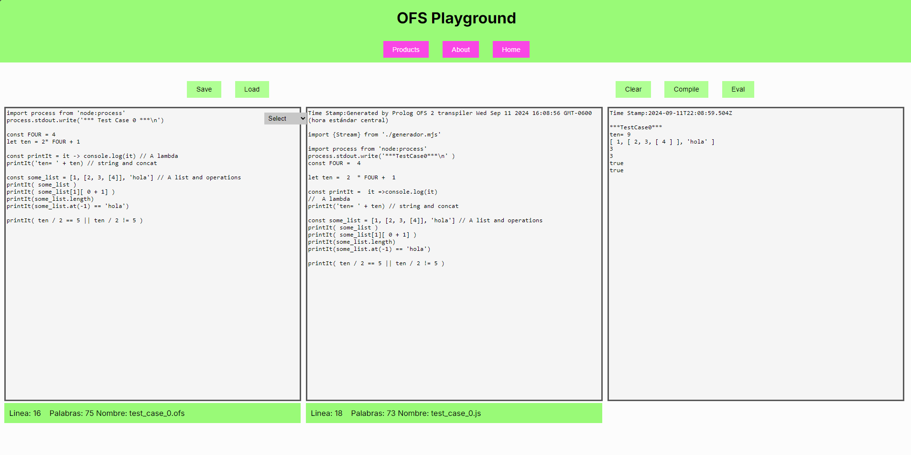

## OFS Paradigmas de Programacion - UNA - 2023

This project is about a transpiler that converts code from a fictional language called OFS to JavaScript. The resulting JavaScript code can be compiled. The webpage was created using Next.js with React, written in TypeScript. The server and the logic for the transpiler were in Prolog. The project also uses a NoSQL database in Firestorage

<details>
  <summary>Webpage screenshots</summary>
  
  
</details>

## Members:
Ariana Solano Vallejos | Nicole Araya Ballestero

## Execution

To run the 'Node.js server'. Next.js uses Node.js as its runtime environment to render pages and serve content on the client side. Run in build mode:
```
npm run build
npm start
```

To run the prolog server, which will be in charge of transpiling the files generated on the client, run:
```
cd prolog
swipl http_server.pl
```
